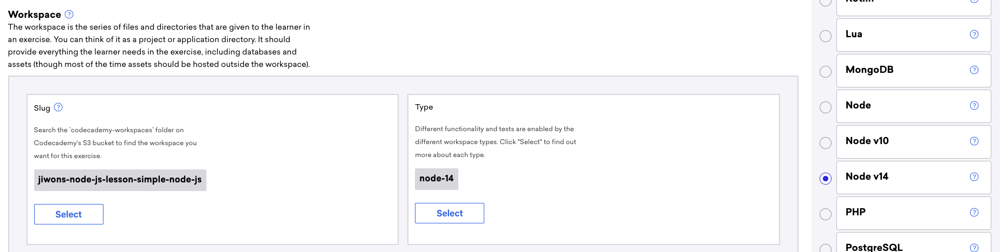
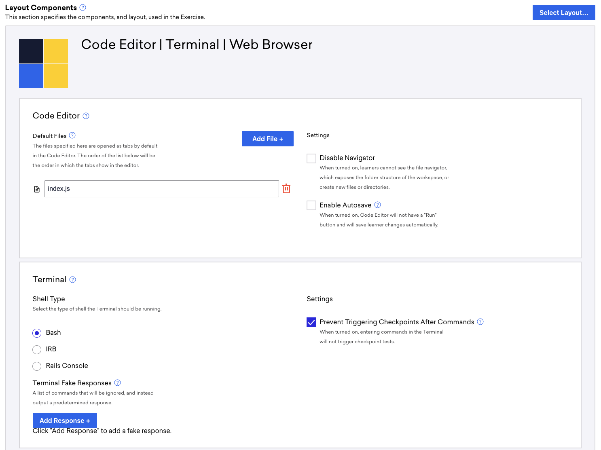
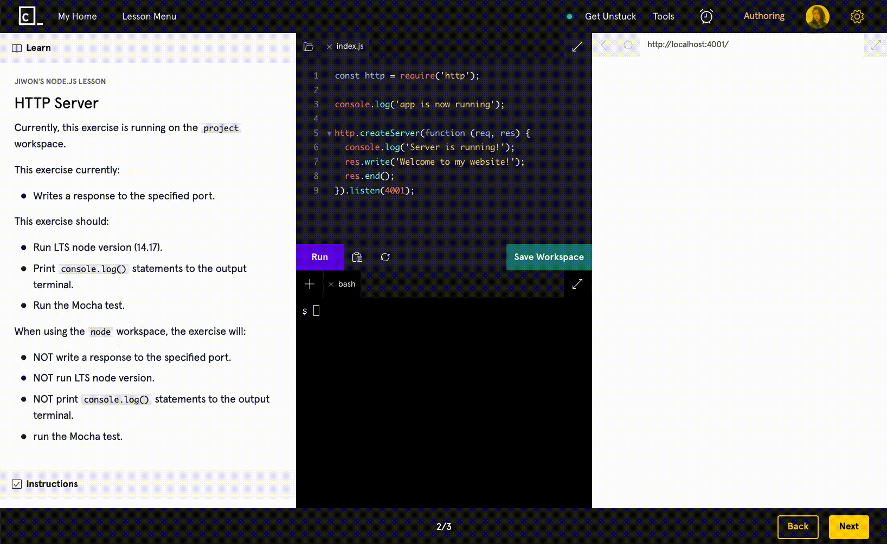
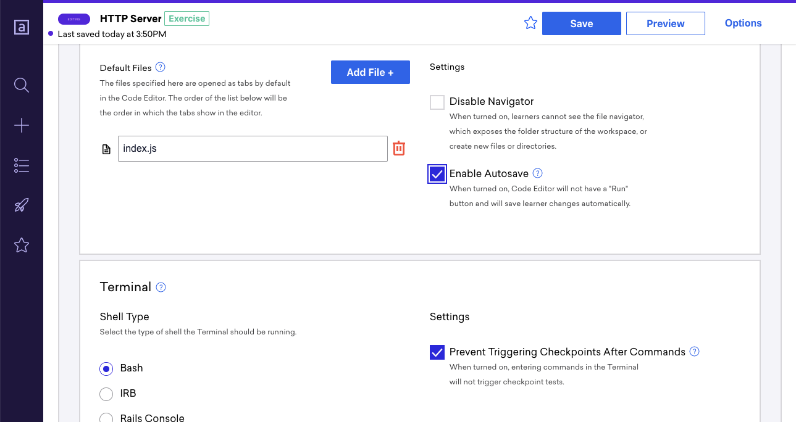
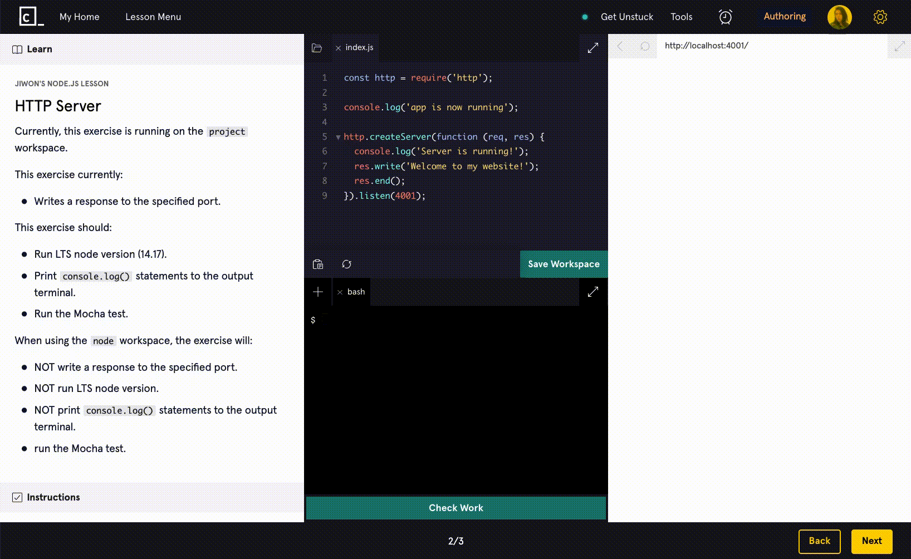
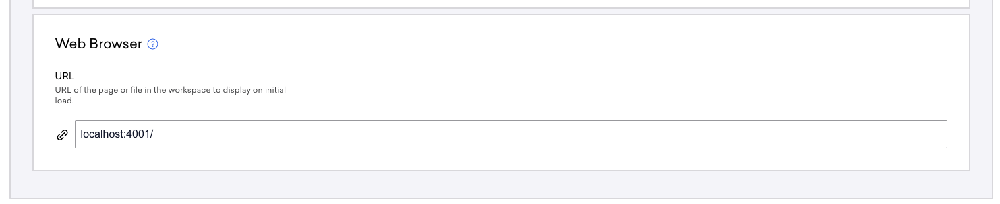
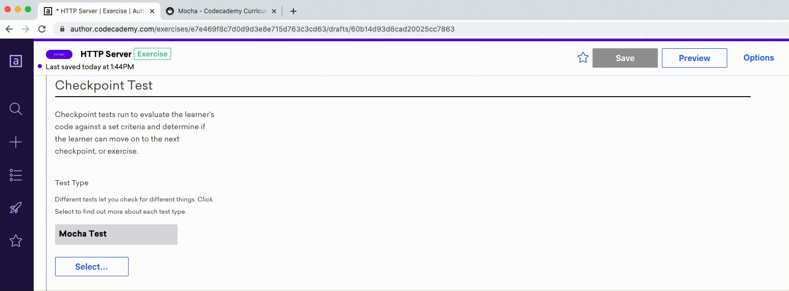

# Node v14 Workspace

You can play around with the workspace type in [this test lesson](https://author.codecademy.com/content-items/a9108b8d84f964ca16e59e66c2ee8ad4/drafts/60a685f600f70c00168b3cb0) in Author.

## Selecting the Node v14 Worskpace

The new Node v14 workspace is available in Author. You can select the "Node v14" workspace type under the Workspace selection of a content item in Author.

## Asynchronouse Code in Workspace

If your workspace code includes a custom server (via `http` or `express`) or any code that continuously runs (does not automatically end), then you will need to do the three things below. If below three things are not done, checkpoint tests will not run as the workspace code will hang the process.

1. Make sure your workspace displays the Terminal window along with any other windows you need to display (meaning you could select the Code Editor | Terminal | Web Browser workspace, for example).

2. As part of the checkpoint instruction for the exercise, we will need to have the learner manually run the app. For example, we will need to instruct learners to run the app via `node app.js`. This is the reason for needing to display the terminal window.

3. Check the "Prevent Triggering Checkpoints After Commands" checkbox under the Terminal window's Settings (see screenshot below). This will prevent the workspace code from automatically running when the exercise is loaded, hence the reason why we need to have learners manually start the app in the terminal. Small note that there is a distinction between "Terminal" and "Output Terminal" -- Terminal allows you to run commands, whereas Output Terminal just prints things to the Terminal.

## Port In Use

When you set up the workspace like in the above section, the learner MUST run the app via terminal (`node app.js`) before clicking on the "Run" button to run the test. If the learner does it the other way around, it won't break anything, but they will get an error saying that the port 4001 is already in use.

To prevent the above from happening, we can check the "Enable Autosave" button in the Layout Components settings.

When the button is checked & exercise is saved, you will see another button ("Check Work") pop up in the workspace. The Check Work button doesn't actually run the code -- it runs the test on the learner's code ONLY. So we will not get the port in use error anymore.

## Running Servers

Whether you create servers using `http ` or `express`, servers created within the workspace most run in port `4001`. If you are also displaying the webpage running on `localhost:4001` in the web browser window of the LE, you must also point the Web Browser's URL in the Layout Components settings like below:

## Using Mocha Test

For more info on writing mocha tests, checkout [this page](http://curriculum-documentation.codecademy.com/tests/mocha/) on the curriculum docs.

Mocha tests require the workspace to have an empty folder called **test**. Even with this folder, the new workspace may throw errors. When experiencing errors, check the "With Babel" checkbox under "Setting" of the Checkpoint Test, save exercise, uncheck the "With Babel" checkbox, then save exercise. This is a bug, but this fix works.

